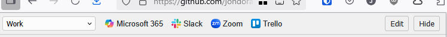

## About

Ever wanted to be able to switch between multiple bookmarks toolbars, without having to setup multiple Firefox profiles? Now you can.

This Firefox extension creates a secondary bookmarks toolbar with a drop-down selector which displays different groups of links.

Edit the links via the add-on toolbar icon or by pressing the Edit button in the toolbar. All links are stored in Markdown.

## Install

(Currently awaiting Mozilla approval - link to addons.mozilla.org to be added)

## Features

- If you hide the native browser bookmarks toolbar, this add-on effectively replaces it - or if the native bookmarks toolbar is enabled, this appears as a secondary toolbar below it 
- Create or edit bookmark groups and lists using markdown - accessible via the extension icon or clicking `Edit` on the toolbar
- Create multiple bookmark groups using markdown headings
- Switch between bookmark groups with ease using the dropdown selector on the toolbar
- Use the `Hide` button to temporarily hide the toolbar on the active tab (reloading will re-enable it)
- Supports favicons
- Supports light and dark mode

## How to use

1) Create or paste a markdown list into the editor to create three bookmark groups - the example below creates groups for personal, work and development bookmarks

2) Save changes
3) Use the selector on the toolbar to switch between groups

## Limitations

- Uses browser local storage - no cloud sync
- May not play nice with some sites - this is when the `Hide` button becomes your friend 😉
- Long bookmark lists will increase the height of the toolbar, blocking the active website below - single row lists are recommended
- No integration with native bookmarks
- Subfolders are not supported
- Desktop only
- The group selection occasionally changes when resizing browser windows

## Possible roadmap items

Let me know if you would actually use any of these!

- [ ] Fix resizing bug
- [ ] Support for Mozilla account sync
- [ ] Better UI for longer bookmark lists
- [ ] Drag and drop reordering of bookmarks
- [ ] Chrome version?
- [ ] Horizontal toolbar option?
